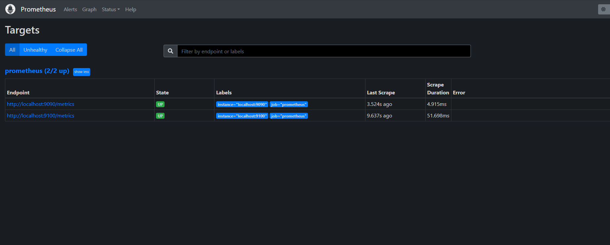

# HOMEWORK_PROMETHEUS_GRAFANA


# Задание 1
Установите Prometheus.

Процесс выполнения
Выполняя задание, сверяйтесь с процессом, отражённым в записи лекции
Создайте пользователя prometheus
Скачайте prometheus и в соответствии с лекцией разместите файлы в целевые директории
Создайте сервис как показано на уроке
Проверьте что prometheus запускается, останавливается, перезапускается и отображает статус с помощью systemctl
Требования к результату
 Прикрепите к файлу README.md скриншот systemctl status prometheus, где будет написано: prometheus.service — Prometheus Service Netology Lesson 9.4 — [Ваши ФИО]

### создадим пользователя
``sudo useradd —no-create-home —shell /bin/false prometheus``

## установимы Prometheus
```
wget https://github.com/prometheus/prometheus/releases/download/v2.40.2/prometheus-2.40.2.linux-amd64.tar.gz
tar xvzf prometheus-3.3.1.linux-amd64.tar.gz
```
создадим директории
```
mkdir /var/lib/prometheus
mkdir /etc/ptometheus
```
копируем и выдадим права
```
cp ./prometheus promtool /usr/local/bin/
cp -R ./console_libraries/ /etc/prometheus/
cp -R ./consoles/ /etc/prometheus/
chown -R prometheus:prometheus /etc/prometheus /var/lib/prometheus
chown prometheus:prometheus /usr/local/bin/prometheus
chown prometheus:prometheus /usr/local/bin/promtool
```

проверим работу
```
/usr/local/bin/prometheus --config.file /etc/prometheus/prometheus.yml --storage.tsdb.path /var/lib/prometheus/ --web.console.templates=/etc/prometheus/consoles --web.console.libraries=/etc/prometheus/console_libraries
```

Настроим запуск как сервис
```
nano /etc/systemd/system/prometheus.service
```
```
[Unit]
Description=Prometheus Service Netology Lesson 9.4
After=network.target
[Service]
User=prometheus
Group=prometheus
Type=simple
ExecStart=/usr/local/bin/prometheus \
--config.file /etc/prometheus/prometheus.yml \
--storage.tsdb.path /var/liЬ/prometheus/ \
--web.console.templates=/etc/prometheus/consoles \
--web.console.libraries=/etc/prometheus/console_libraries
ExecReload=/bin/kill -HUP $MAINPID Restart=on-failure
[Install]
WantedBy=muti-user.target
```
```
mkdir -p /var/lib/prometheus
chown -R prometheus:prometheus /var/liЬ/prometheus
```


# Задание 2
Установите Node Exporter.

Процесс выполнения
Выполняя ДЗ сверяйтесь с процессом отражённым в записи лекции.
Скачайте node exporter приведённый в презентации и в соответствии с лекцией разместите файлы в целевые директории
Создайте сервис для как показано на уроке
Проверьте что node exporter запускается, останавливается, перезапускается и отображает статус с помощью systemctl
Требования к результату
 Прикрепите к файлу README.md скриншот systemctl status node-exporter, где будет написано: node-exporter.service — Node Exporter Netology Lesson 9.4 — [Ваши ФИО]


## установим Nodexporter
```
wget https://github.com/prometheus/node_exporter/releases/download/vl.4.0/node_exporter-l.4.0.linux-amd64.tar.gz

tar xvzf https://github.com/prometheus/node_exporter/releases/download/vl.4.0/node_exporter-l.4.0.linux-amd64.tar.gz

cd /node_exporter-l.4.0.linux-amd64
mkdir /etc/prometheus/node-exporter/

cp ./node_exporter  /etc/prometheus/node-exporter/

chown -R prometheus:prometheus /etc/prometheus/node-exporter/

ls -la /etc/prometheus/node-exporter/
```

запустим как сервис
```
nano /etc/systemd/system/node-exporter.service

[Unit]
Description=Node Exporter Lesson 9.4
After=network.target
[Service]
User=prometheus
Group=prometheus
Type=simple
ExecStart=/etc/prometheus/node-exporter/node_exporter
[Install]
WantedBy=multi-user.target
```

### Пропишите автозапуск:
``sudo systemctl enable node-exporter``
### Запустите сервис:
``sudo systemctl start node-exporter``
### Проверьте статус сервиса:
``sudo systemctl status node-exporter``


Автозапуск 
```
sudo crontab -e
```

 Добавьте следующие строки в файл crontab:
```
@reboot sleep 60 && systemctl start prometheus.service
*/10 * * * * systemctl restart prometheus.service
```


# Задание 3
Подключите Node Exporter к серверу Prometheus.

Процесс выполнения
Выполняя ДЗ сверяйтесь с процессом отражённым в записи лекции.
Отредактируйте prometheus.yaml, добавив в массив таргетов установленный в задании 2 node exporter
Перезапустите prometheus
Проверьте что он запустился
Требования к результату
 Прикрепите к файлу README.md скриншот конфигурации из интерфейса Prometheus вкладки Status > Configuration
 Прикрепите к файлу README.md скриншот из интерфейса Prometheus вкладки Status > Targets, чтобы было видно минимум два эндпоинта

``nano /etc/prometheus/prometheus.yml``



## Установка Grafana 
```
sudo apt-get install -y adduser libfontconfig1 musl
wget https://dl.grafana.com/oss/release/grafana_12.0.0_amd64.deb
sudo dpkg -i grafana_12.0.0_amd64.deb
```
----
```
wget https://dl.grafana.com/oss/release/grafana-12.0.0.linux-amd64.tar.gz
tar -zxvf grafana-12.0.0.linux-amd64.tar.gz
```
----
```
systemctl enable grafana-server
systemctl start grafana-server
systemctl status grafana-server
```
подключаемся
http://192.168.230.130:3000/
Admin
admin

art
1234

### сброс пароля
```
$ sudo sqlite3 /var/lib/grafana/grafana.db

sqlite> update user set password = '59acf18b94d7eb0694c61e60ce44c110c7a683ac6a8f09580d626f90f4a242000746579358d77dd9e570e83fa24faa88a8a6', salt = 'F3FAxVm33R' where login = 'admin';
sqlite> .exit
```
--------------

Задание 4*
Установите Grafana.

Требования к результату
 Прикрепите к файлу README.md скриншот левого нижнего угла интерфейса, чтобы при наведении на иконку пользователя были видны ваши ФИО
 

 Задание 5*
Интегрируйте Grafana и Prometheus.

